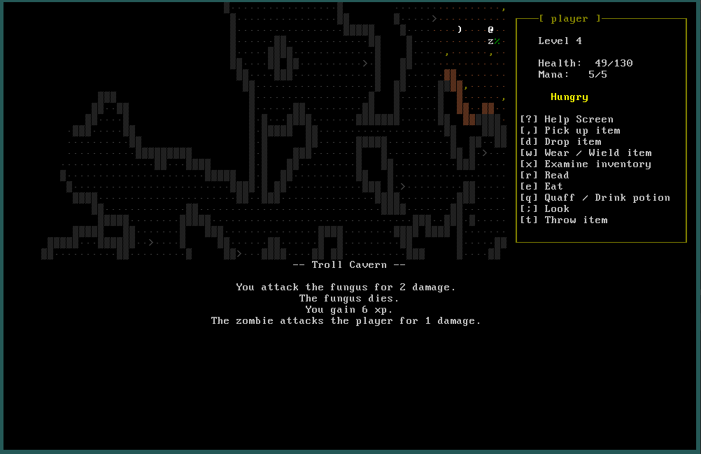

# Troll Cavern

A roguelike game written in Java. The terminal emulator used is [AsciiPanel](https://github.com/trystan/AsciiPanel), I'm now spending some time refactoring the code, splitting the various creature, potion and weapon generators into separate classes and adding a simple user interface for the player.

Once this part is finished I'd like to add the following features, one module at a time:
* NPC interaction
* Gold and shops
* Dungeons as well as caves
* Mini quests

